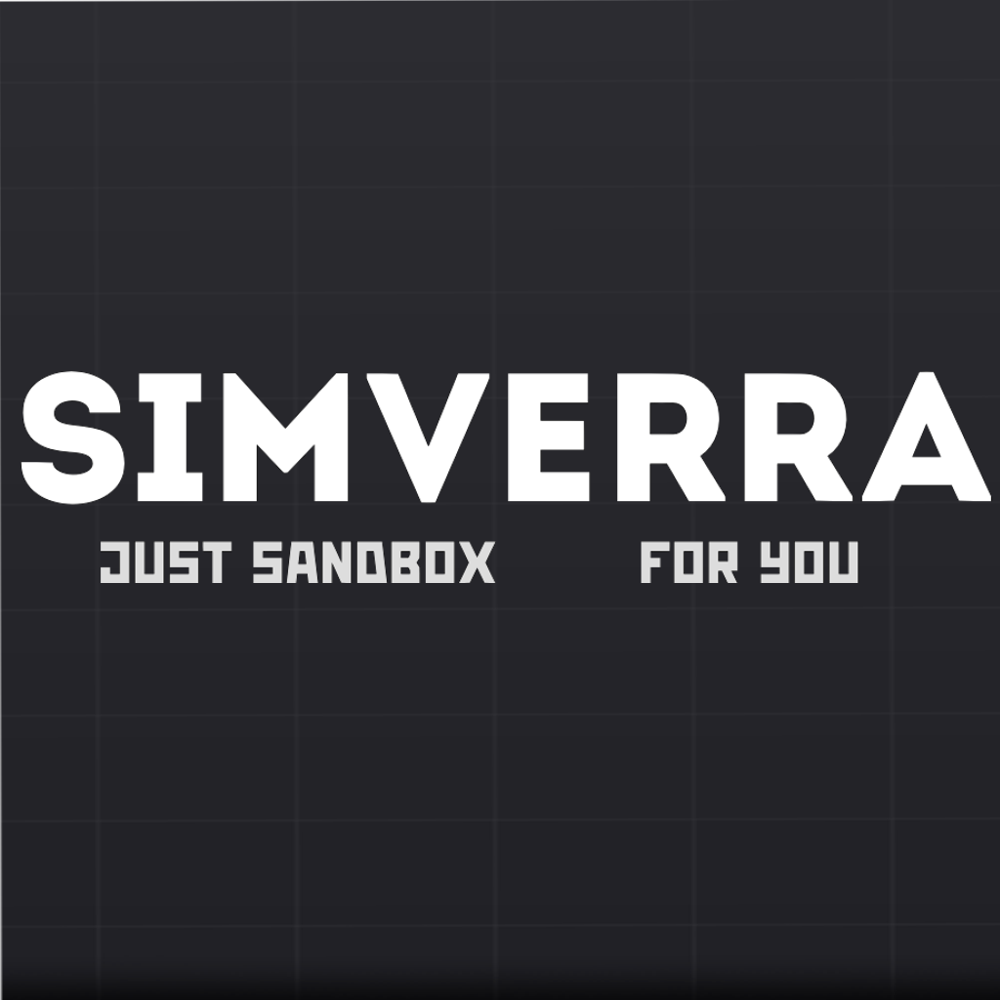

# 🎨 Simverra Brand Guidelines

<p align="center">
  
</p>

---

## About

These assets are provided for press, content creators, partners, and community members who would like to reference or showcase **Simverra**.

Please use the original files without modifying the logo proportions, colors, or design.

All official brand assets can be found here:

📂 **[Assets/Images](./Assets/Images/)**

---

# Logo Collection

## 1. Main Logo

Transparent version of the official logo.

**File**

```
Simverra_logo.png
```

**Resolution**

```
946 × 362
```

<p align="center">
  
</p>

---

## 2. Main Logo (Background)

Official logo with background.

**File**

```
Simverra_logo_bg.png
```

**Resolution**

```
1024 × 1024
```

<p align="center">
  
</p>

---

## 3. Capsule

Official promotional capsule artwork.

**File**

```
Simverra_capsule.png
```

**Resolution**

```
1600 × 900
```

<p align="center">
  
</p>

---

## 4. Capsule (Upscaled)

Promotional capsule with an extended background.

**File**

```
Simverra_capsule upscale.png
```

**Resolution**

```
1600 × 900
```

<p align="center">
  
</p>

---

# Usage Guidelines

You are welcome to use these assets for:

- ✅ News articles
- ✅ Videos and livestreams
- ✅ Reviews
- ✅ Community projects
- ✅ Wiki pages
- ✅ Fan websites
- ✅ Social media posts

---

Please **do not**:

- ❌ Stretch or distort the logo
- ❌ Change the official colors
- ❌ Add filters or visual effects
- ❌ Remove parts of the artwork
- ❌ Use the assets in a misleading way

---

# Need Something Else?

If you require additional branding assets, higher-resolution files, or press materials, please contact the Simverra development team.

---

<div align="center">

**Made with ❤️ by the Simverra**

</div>