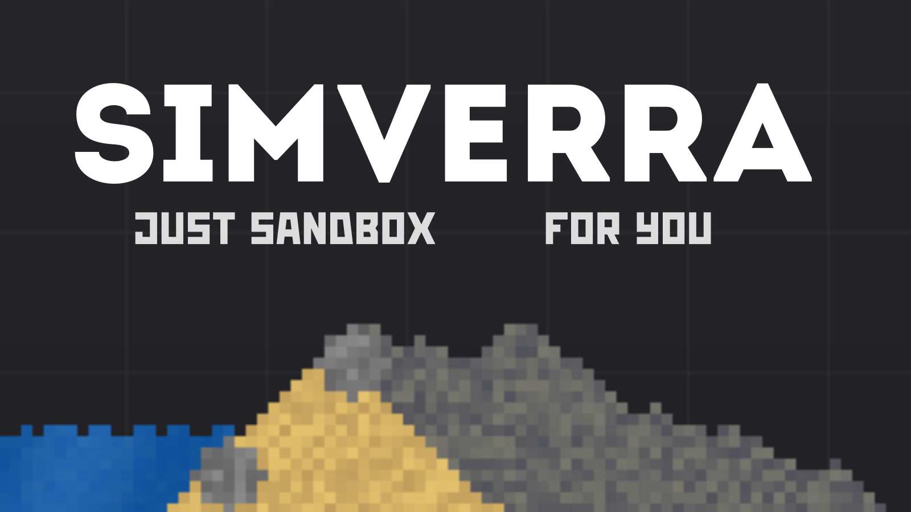

<div align="center">


<!-- Banner -->
<p align="center">
  
</p>

### A Physics-Based Sandbox Made Just for You

Build • Experiment • Destroy • Create
---


</div>

ifyou want to use our logo visit:

📂 [brand guidline](./BRANDGUIDLINE.md)
# About

**Simverra** is a physics-based sandbox game developed by a team of two passionate developers.

Create anything you can imagine using realistic physics simulation, flowing water, dynamic sand, interactive objects, and powerful building tools.

Whether you enjoy building massive structures, designing complex chain reactions, running experiments, or simply watching the world evolve, every play session is unique.

## Features

- 🌊 Realistic water simulation
- 🏜️ Dynamic sand physics
- ⚙️ Interactive physics objects
- 🏗️ Powerful building tools
- 💥 Chain reactions
- 🎨 Infinite creativity
- 🔧 Custom game configuration
- 🎵 Integrated audio system

<p align="center">
  
</p>


# Gameplay

### Cozy game
We designed Simvera to be a cozy place where you can slow down, experiment, and simply enjoy watching the world react naturally. Whether you're building or just playing with physics, there's always something satisfying to discover.


### create anything
Turn simple ideas into amazing creations. Build machines, design worlds, trigger explosions, or embrace your inner evil genius and see what happens. Every object follows real physics, making experimentation endlessly fun.


### Optimization
Python is slow high end lang. But we trying to make game as effective as posible!


---

# ⚠️ Early Development

Simverra is currently under active development.

Expect:

- Bugs
- Missing features
- Performance issues
- Frequent updates

Your feedback helps shape the future of the project.

---

# Project Architecture

```
Simverra/
├── Assets/
├── Sand Engine/
├── README.md
└── ...
```

## Sand Engine

| Folder                                     | Description |
|--------------------------------------------|-------------|
| 📂 [Additions](./SandEngine/Additions/)    | APIs and additional utilities |
| 🔊 [Audio](./SandEngine/Audio/)            | Audio engine |
| 📊 [DATA](./SandEngine/DATA/)              | Game configuration and saved data |
| ⚙️ [Physics](./SandEngine/Physics/)        | Physics engine |
| 🎨 [Visuals](./SandEngine/Visuals/)        | Rendering, UI and drawing |
| 🐞 [Debugger](./SandEngine/Debugger/)      | Debug console |
| 📚 [libs](./SandEngine/libs/)              | External libraries |
| 🧠 [Logic Engine](./SandEngine/Additions/) | Core gameplay logic |
| 🌳 [root](./SandEngine/root/)              | Engine entry point |

## Assets

| Folder | Description           |
|---------|-----------------------|
| 🖼️ Graphics | Sprites & textures    |
| 🎞️ Shaders | .fs shaders           |
| 🎵 Audio | Sound effects & music |
| 🎥 Gifs | README animations     |

---

# Building

```bash
git clone https://github.com/Binzigames/Simverra.git

cd Simverra

```
next step do in your ide (recomended : Pycharm / )

then:

```
pip install raylib pyray colorama pypresence
```


---

# Contributing

Contributions, bug reports and feature suggestions are always welcome.

If you find a bug, please open an Issue.

---

# Support

If you enjoy Simverra, consider giving the repository a ⭐.

It really helps us continue development.

---

# Thank You ❤️

Thank you for checking out **Simverra**.

Every download, issue report, pull request and piece of feedback helps make the game better.

Stay tuned for future updates!

---


# Contact us on 
- gmail : porko.dev.ua@gmail.com
- discord : @porko_dev
